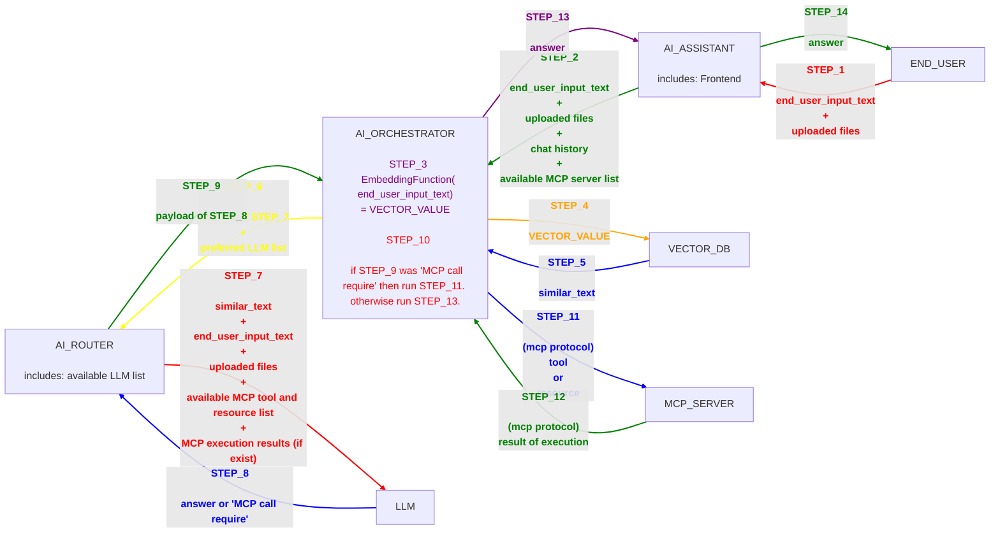

# AI

IIIIIIIIIIIIIIIIIIIIIIIIIIIIIIII

IIIIIIIIIIIIIIIIIIIIIIIIIIIIIIII

## 📌 mantıksal analiz robotu (⟷ yapay zeka ⟷ Artificial Intelligence ⟷ AI)

bir bilgisayarın, gerçek bir düşünebilen canlı gibi davranması (insan zekasını taklit edebilme) yeteneğidir. Bu terim kullanılırken arka planda bu işin nasıl yaptığı ile ilgilenilmez.

## 📌 Makine öğrenimi (⟷ machine learning ⟷ ML)

`AI` sanal bir beyindir. Fakat kendini eğitebilmesi konusu ayrıdır ve `ML` konusuna girer.

## 📌 yapay sinir ağı (⟷ YSA ⟷ Artificial neural network ⟷ ANN)

`YSA`, yapay bir zeka yapabilmek için bir mimaridir (yöntemdir). yapay zeka için `YSA` kullanılmak zorunda değiliz. onun yerine eski oyunlarda olduğu gibi, araba yarışı tasarlayabilir ve diğer yarışçıların da akıllı davranabilmesini sağlayabiliriz.

## 📌 Bağlantısallık (Connectionism)

`YSA` yapısının felsefesi (teorisidir). sinir ağları arasındaki bağlantıları temsil eden teoridir.

## 📌 transformers

`YSA`'nın bir özelliğidir. Input'ların paralel işlenmesini sağlayan mimaridir.

Paralel işleme yapmayan alternatif mimariler: `RNN` ve `LSTM`.

## 📌 Generative AI (⟷ Generative artificial intelligence ⟷ generative AI ⟷ GenAI ⟷ GAI ⟷ üretken yapay zeka)

yeni şeyleri kendi üretebilen zekalardır. bunu yapmak için yine geçmiş verilerden yararlanır.

## 📌 Dil modeli (⟷ Language Model ⟷ LM)

`dil`, burada input'u temsil eder. örnekler:
- `Türkçe` metin
- `İngilizce` metin
- `Java` kodu
- Özel formatlanmış audit log dosyası
- `regex`

`model`, matematiksel bir fonksiyon. input olarak `vector` alır, çıktı olarak yine `vector` verir.

`model`, kendi içindeki `Weight` sayısı (ve diğer bazı şeylerin) büyüklüğüne göre kategorize edilir. gerçek örnek değerler:

- `Small (or Edge)` - 1B to 4B
- `Medium (Desktop)` - 7B to 14B
- `Large`	- 70B - 100B+
- `Very Large (Frontier)` - 500B to 1T+

bu büyüklüklerin resmi bir sınıflandırması yoktur. 

büyük olanlar `LLM (⟷ Large Language Model)`, küçük olanlar `SLM (⟷ Small Language Model)` olarak sınıflandırılırlar. Medium olanlar, `MLM` olarka kısaltılmıyor çünkü `YSA` dünyasında `MLM`'nin farklı anlamı var.

## 📌 markalar ve ürünler

- company: `Meta`

  - `Llama (⟷ Large Language Model Meta AI)`

- company: `OpenAI`

  - `GPT`

- company: `Google`

  - `Gemini` - sadece bulut hizmeti ile sunuluyor.

  - `Gemma` - daha güçsüz, local'e kurulabiliyor.

- company: `Anthropic`

  - `Claude` ürün ailesi ismi. altinda şu ürünler var:
    - `Haiku` (ucuz ve güçsüz)
    - `Sonnet` (dengeli)
    - `opus` (pahalı ve güçlü)

- company: `Alibaba`

  - `Qwen`

- company: `DeepSeek`

  - `DeepSeek`

## 📌 ollama

açık kaynaklı bir yazılım.

her `LM` bir fonksiyon. bu fonksiyonları açık kaynaklı `gguf` formatında dosyada tutarız. `ollama`'yı çalıştırdığımızda:
- `gguf` dosyasını okur,
- optimizasyon yapar,
- `HTTP` `API` açar ve bu fonksiyonun çağrılabilmesini sağlar. `OpenAI` `API`'si ile uyumlu `API` sunar ama ondan bağımsız kendi `API`'si de var.

## 📌 OpenRouter

`YSA` için `API gateway`'dir. herhangi bir `YSA` ile `API` üzerinden text ve görsel gibi medyalarla iletişim kurabilmemizi sağlar. Açık kaynaklı değildir. Ve sadece bulutta çalışır. local'e indirebileceğimiz bir yazılım değildir.

Bu yazılıma alternatif local'e kurulabilecek açık kaynaklı yazılımlar: `LiteLLM`, `Bifrost`.

`OpenAI` şirketinin kendi ürünleri için kullandığı `API` formatı piyasada sıkça tercih ediliyor. Bu sebeple `OpenRouter`, `OpenAI` ile çok uyumlu olacak şekilde tasarlanmış durumda.

## 📌 Open WebUI

`YSA` için açık kaynaklı frontend yazılımıdır.

`ollama` ve `OpenAI` uyumlu `API`'lerin son kullanıcı ile kullanılabilmesini sağlar.

## 📌 Retrieval-Augmented Generation (⟷ RAG)

`türkçe`: `Bilgiyle Zenginleştirilmiş Yanıtlama`.

dış kaynaklardan bilgi toplayıp, `LLM`'e bunlarla birlikte soru sormayı temsil eden genel bir terim.

## 📌 mcp (⟷ Model Context Protocol)

açık kaynaklı protocol'dür. bir program, `TCP` üzerindeki haberleşme protocol'lerini kullanarak `API` sunarak hizmet sunar. `agent` external yerlerden bilgi toplamak icin bu `API`'lerden yararlanmir.

`MCP`'nn sunduğu her `API` fonksiyonu 3 çeşit olabilir:

### 📌📌 tool

işlemin nerede execute edileceği belli, ama neyin execute edileceği tamamen MCP client'a kamış fonksiyonlardır.

örneğin; vereceğim `SQL`'i `Oracle DB`'de çalıştıran fonksiyon.

### 📌📌 resource

önceden belirlenmiş, sabit bir işlem yapabilmemizi sağlar.

örneğin; ID'sini vereceğim customer'ın bilgilerini döndüren fonksiyon.

### 📌📌 prompt

hazır prompt şablonları sunar.

## 📌 skill

her `skill` birer text dosyasıdır. örnek:

```markdown
# Skill: Unit Test Yazma

## Açıklama
Verilen fonksiyon veya sınıf için sınır durumlarını (edge cases) da kapsayan, standartlara uygun unit test kodları üretir.

## Parametreler
* **source_code** (Metin, Zorunlu): Test yazılacak kaynak kod veya fonksiyon.
* **framework** (Metin, İsteğe Bağlı): Kullanılacak test kütüphanesi (örn: PyTest, Jest, JUnit).

## Beklenen Çıktı
Kaynak koda uygun, çalıştırılmaya hazır unit test dosyası içeriği.
```

`AI assistant` bu `skill` dosyalarının isimlerini ve açıklama kısımlarını `AI`'a yollar. Artık `AI`, eğer son kullanıcı unit test yazdırmak isterse, tüm dosyası `AI assistant`'tan ister ve okur ve sonra bu dosyadaki kurallara mutlaka uyarak işlemlere devam eder.

## 📌 Github Copilot customizations

bu tanımlar sadece `github` `copilot` (`vscode` eklnetisi vem masaüstü application'ı) için geçerli terimler. bu terimler genel `AI` dünyasında farklı anlamlara gelebilir.

Terimlerin farklılıkları burada anlatılmış:

https://code.visualstudio.com/docs/agents/concepts/customization#_customization-options-at-a-glance

### 📌📌 Prompt

manuel çağrılır. bi senaryo dosyasıdır. örnek:

```markdown
---
description: Java kodunu review et
---

Seçili Java kodunu incele.

Bug, null-safety ve performans sorunlarını listele.

Minimal düzeltme öner.
```

bu dosya burada ise:

`.github/prompts/java-review.prompt.md`

bunu çağırmak için şu yazılmalıdır prompt'a:

```text
/java-review
```

### 📌📌 Skill

farklı başlıkta açıklanmıştır.

### 📌📌 instruction

her chat'e mutlaka otomatik eklenir. ama bazı `instruction`'lar `regex` gibi tanımlarla ne zaman yollanacağı belirlenebilir.

örneğin; aşağıdaki `instruction` projemizde varsa, `java` dosyası chat'e eklenmişse, bu `instruction` mutlaka `AI`'a yollanır.

```markdown
---
applyTo: "*.java*"
---
- Java 21 kullan.
- Constructor injection kullan.
- Testlerde JUnit 5 kullan.
- Build komutu olarak `./mvnw` kullan.
```

### 📌📌 agent

`instruction`, `skill`, `mcp` servers, `prompt` gibi özellikleri 1 noktadan yönetip gruplamamızı sağlıyor. böylece 1 `agent` değişikliği yapıp, tüm bu özellikler arasından sadece bazıları aktif edebiliriz.

örnek olarak proje dizinimiz içinde şurada dosya oluşturursak:

`.github/agents/maven-java-maintainer.agent.md`

`vscode` `copilot` eklentisinde, `AI` chat penceresini açtığımız zaman bu profili (`agent`'ı) direk seçip `AI` ile chat'leşmeye başlayabiliriz.

`.github/agents/maven-java-maintainer.agent.md` dosyası içinde hangi tool'ların aktif olacağını vs yazabiliyoruz. Hatta bağımsız dosyalara referans verebiliyoruz. Böylece örneğin farklı `agent`'lar ortak `instruction`'lar kullanabilir.

## 📌 NLP (⟷ Natural Language Processing ⟷ Doğal Dil İşleme)

başka başlıkta anlatılmaktadır.

## 📌 derin öğrenme (⟷ deep learning ⟷ deep structured learning ⟷ hiyerarşik öğrenme)

makine öğrenmesinin bir alt dalıdır. çok katmanlı `YSA`'ların kullanılmasıdır. örnek: araba kullanan `YSA` yapacağız. level'lar:

- piksel
- köşeler (kenarlar)
- direksiyon, fren, pencere
- araba

## 📌 YSA modelinin boyutu

modelin boyutu eğitilen datanın boyutu ile orantılı değil.

istediğimiz kadar küçük bir modeli, istediğimiz kadar büyük bir data ile eğitebiliriz. model içinde her konu (domain) (örneğin fizik, matematik, Java) ayrı modül olarka durmaz. aynı ağırlıklar tüm konular için hesaplamaya girer. bu sebeple; küçük model kullanıp büyük eğitim datası verirsek, aynı ağırlıkları birçok farklı konu için kullanmış oluruz. böyle olursa, model detayları unutmaya başlar.

modelin boyutu, model tasarlanırken, hard-coded model yazılımcısı tarafından set edilir.

modelin boyutu ile eğitim verilecek data boyutnun doğru orantılı olmasında kesinlikle fayda var.

## 📌 AI assistant

bu yazılımın kendisinde `LLM`'e benzer ufak ta olsa bir `YSA` barındırmak zorunda değil. `YSA` barındırıp barındırmayacağı, `AI assistant`'ın neleri desteklediğine bağlı değişir.

son kullanıcı ile ilk temasa gecen yazılımdır. Bu sebeple `AI application` olarakta adlandırılırlar.

örnekler:

- `ChatGPT`
- `GitHub copilot`
- `Claude App`
- `Microsoft Copilot`

## 📌 AI Ochestrator

bu yazılımın kendisinde, `LLM`'e benzer ufak ta olsa bir `YSA` barındırmak zorunda değildir.

Eğer bu yazılım genelde ortamlarda execution yapabiliyor, ve verilen görevi bitirene kadar sürekli döngüsel olarka kendi işlem yapmaya odaklanmış ise `AI agent` terimi kullanılıyor.

## 📌 Vector DB

Aşağıdaki diyagram https://mermaid.live üzerinden daha net görüntülenebilir.




`Vector` `DB`'de query atarak, yakın konulardaki metin sonuçlarını bulmuş oluruz. Bu akışın `YSA` ile alakası yok aslında. Ama `YSA`'ya tüm dökümanlarımızı atarsak çok kaynak tüketir diye, sadece ilişkili data'ları atmamız gerekir.

`Vector` `DB`'ye sorgu attığımız zaman `vector` tipinde input veririz. return olarak `DB`'deki (`vector` uzayındaki), sorguladığımız `vector`'e en yakın `vector`'ü döner.

`Vector` `DB`'ye insert etmeden önce, insert edeceğimiz datayı `vector`'e çevirmeliyiz. Bu işlemi yaparken `DB`'den bağımsız çalışan `Embedding` `model`'den yararlanmak zorundayız. `Vector` `DB`'ye query atarken mutlaka aynı `Embedding` `model`'den yararlanmak zorundayız. Çünkü `Embedding` başlığındaki örnekte gösterilen `X` Ekseni'nin `Canlı mı?` bilgisini tuttuğunu başka türlü standart hale getiremeyiz.

### 📌📌 Embedding

`Dil`'i (`string`'i) sayısal veriye (`vector`'e) dönüştürme işlemidir.

`Embedding` `model`imiz şunları sabit kabul etsin:

`X` Ekseni: "Canlı mı?" (1.0 = Tamamen canlı, 0.0 = Cansız)

`Y` Ekseni: "Evcil mi?" (1.0 = Çok evcil, 0.0 = Vahşi/Evcil değil)

`Z` Ekseni: "Boyut" (1.0 = Devasa, 0.0 = Mikroskobik)

Şimdi bazı kelimeleri sayısala çevirelim:

- "Kedi" -> [0.9, 0.9, 0.2] -> (Canlı, evcil, küçük)

- "Köpek" -> [0.9, 0.85, 0.25] -> (Canlı, evcil, kediye yakın boyutta)

- "Aslan" -> [0.95, 0.1, 0.6] -> (Canlı, hiç evcil değil, büyük)

- "Masa" -> [0.0, 0.0, 0.4] -> (Cansız, evcillikle alakası yok, orta boy)

## 📌 Bulanık mantık (⟷ bulanık eseme ⟷ puslu mantık ⟷ Fuzzy logic)

Bulanık mantığın temeli bulanık küme ve alt kümelere dayanır. Klasik yaklaşımda bir varlık ya kümenin elemanıdır (1) ya da değildir (0). bulanık mantık ile bir varlık üyelik derecesine göre birden fazla kümenin elemanı olabilir. üyelik derecesi 0-1 arasındadır. örnek olarak sıcaklık derecesi verilebilir. belirli bir seviyeden sonrasını sıcak belirli bir seviyeden sonrasını soğuk olarak ele alırsak; ılık sıcaklıkları tanımlayabiliriz.

## 📌 Sinaptik (⟷ Sinaptic)

`Sinaps (⟷ Synapse)` kelimesinde geliyor. `Sinaps`; `nöron (⟷ sinir hücresi ⟷ neuron)` denilen yapıdan, diğer nöronlara ya da kas ya da salgı bezleri gibi nöron olmayan hücrelere mesaj iletmesine olanak tanıyan özelleşmiş bağlantı noktalarıdır.

## 📌 YSA yapısı

Giriş data'sı, her __hücre (⟷ node ⟷ düğüm)__ denilen yapıya geldiğinde __ağırlık (⟷ W ⟷ Weight)__ değeri ile çarpılır. Her girişten gelen aynı derecede önemsenmeyeceği için bu çarpım işlemi yapılır.

Bütün girişler çağrıldıktan sonra sinir içerisinde bir matematiksel işleme tabi tutulurlar. Bu işlem "toplama fonksiyonu" olarak adlandırılır. Burada isim karışıklığı olabilir. Bu metot sadece toplama çarpımı değildir. Herhangi bir matematiksel işlem olabilir.

Çıkan çıktı ise en son yine bir matematiksel işlemden geçer. En sonki bu işlem çıkış için bir filtre görevi görür ve aktivasyon fonksiyonu ismini alır. Burada da isim karışıklığı olabilir. "aktivasyon fonksiyonu" matematikteki özel bir fonksiyona denk geliyor. Fakat YSA'da bu fonksiyon herhangi bir işlem olabilir.

## 📌 YSA Katmanlar (⟷ Layers)

YSA'nın ilk girdi aldığı hücreler ve son çıkışa giden hücreler arasında da hücreler olabilir. aradaki katmanlara (ilk ve son katmanlar hariç) `gizli katmanlar (⟷ ara katmanlar)` denir. Dolayısı ile gizli katmanlı olan bir ağ, en az 3 katmandan oluşuyordur.

çok katmanlı YSA en az 2 katmandan oluşur.

bir YSA en az 1 katmandan oluşabilir.

## 📌 Ağın Eğitilmesi

YSA'nın eğitilmesi için doğru olarak bilinen giriş ve çıkış değerlerinin elimizde olması gerekir. YSA'ya girdiler verilir ve YSA'nın verdiği çıktı ile gerçek çıktı karşılaştırılır. İşte bu hata payına göre, __ağırlık__ değerleri her işlem sonrası değiştirilir. Bu eğitim şekline __geri besleme (⟷ geri yayılım ⟷ backpropagation)__ denir. Birçok farklı __eğitim (⟷ training)__ şekli düşünülebilir.

Ağa ilk `W` değerleri ya rastgele yada belli referanslara dayanılarak ta atanabilir.

Test süreçlerinde YSA'nın eğitilmemesi gerekmektedir.

## 📌 Hopfield Ağları (Hopfield Net)

Aşağıdaki kurallara uyan sinir ağlarına verilen özel isimdir. Bunun gibi birçok ağ mevcuttur.

- Tüm hücrelerde sadece 1 ve 0 değerleri giriş çıkışlarda olmalıdır

- Nöronlara gelen ağırlıklar aktivasyon fonksiyonuna gelmeden hemen önce toplanırlar

- Nöronlarda aktivasyon fonksiyonu olmalı ve eşik değeri kullanılmalıdır

Katman kavramı yoktur. Tüm hücreler diğer tüm hücrelere bağlıdır. Yani aslında tek katmanlıdır diyebiliriz. Böylece tüm girişler (hücreler) aynı zamanda çıkışları verecektir. `n` girişli ve `n` çıkışlıdır. Her bir hücre çıkışı, bir sonraki iterasyonda diğer tüm hücrelerin girişine etki etmektedir.

## 📌 iterasyon vs epoch

`epoch`'un `Türkçe` kelime anlamı: devir, çağ, dönem'dir.

iterasyon; `YSA`'nın bir kere input alıp, bir kere çıktı vermesine kadar olan süreçtir.

`YSA`'lar eğitilirken bir eğitim seti (giriş ve çıkış seti) olmaktadır. Bu tüm set `YSA`'ya verilir ve `YSA` kendini sonuçlara göre eğitir. Tüm eğitim seti dolaşıldığında bir epoch süresi geçmiş sayılır. YSA eğitiminde bazen epoch sayısını (aynı eğitim seti için) birçok kere geçmek gerekebilir.

## 📌 Basamak (⟷ adım ⟷ step ⟷ staircase) fonksiyonu

Belirli aralıklarda sadece 1 sayıyı çıktı olarak veren fonksiyonlar grubudur. Örnek; "Heaviside step function", "signum", "Constant" bu kümenin içindedir.

## 📌 Sigmoid fonksiyonu (simge: S)

bu fonksiyon her girdi için 0 ile 1 arasında değer üretir.

```
f(x)= 1/1+e^(-1)
```

## 📌 Eşik Değer (threshold) fonksiyonları

bu bir fonksiyon grubudur. `Sigmoid` ve `basamak` fonksiyonları grubun içindedir. eşik değerlere göre sonuç verirler.
