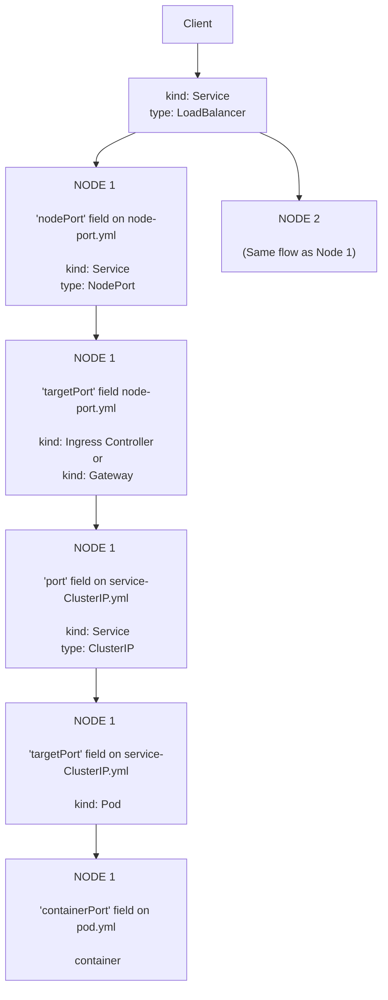

# VIRTUALIZATION KUBERNETES

IIIIIIIIIIIIIIIIIIIIIIIIIIIIIIII

IIIIIIIIIIIIIIIIIIIIIIIIIIIIIIII

## 📌 Kubeadm

komut satırı uygulamasıdır. `K8s` için admin işlemleri sağlıyor.

## 📌 workload

`workload` sistemsel modüller dışında kalan her modüldür.

Örneğin; `etcd` bir `workload` değildir, ama `Pod`, `Deployment` birer `workload`'dır.

## 📌 components

### 📌📌 Control Plane Components (⟷ Master Components)

Sistemler modullerin olduğu modüle ailesidir.

1 cluster'da 1 tane vardır.

#### 📌📌📌 Kube-apiserver

API sunuyor. Admin client'lar buraya bağlanıyor.

#### 📌📌📌 etcd

sistem için gerekli tüm key-value'lar bu DB'dedir.

#### 📌📌📌 kube-scheduler

yeni oluşturulan `POD`'ları node'lara atayan modüldür.

#### 📌📌📌 kube-controller-manager

- node'ların ayakta olup olmadığını kontrol eder
- açılan `Pod`'ların doğru adet olduğunu kontrol eder

gibi işlevleri vardır. desired state'e gelmesi için sürekli çalışır.

#### 📌📌📌 cloud-controller-manager

`kube-controller-manager`'dan tamamen farklı görevdedir. `K8s` ile dış dünya arasında olan bir köprüdür. Örneğin; `AWS` bir ek özellik istediği zaman, bu yazılım aracılığı ile bunu yapar.

### 📌📌 node components

node, bir `VM` yada fiziksel makinedir.

Her node içerisinde minimum aşağıdaki modüller çalışır.

#### 📌📌📌 Kubelet

bu yazılım `kube-controller-manager`'dan emirleri alır ve yerine getirir. o node üzerinde yeni Pod'ların ayağa kaldırılması, kapatılması gibi işlevleri yerine getiriyor.

#### 📌📌📌 kube-proxy

opsiyoneldir. çünkü hiç network işlemi yapmadan da sistem çalıştırılabilir.

`service`, port yönlendirme, gibi network'sel işlemlerinin altyapısının her node'da çalışmasını sağlayan yazılımdır. network proxy yazılımıdır.

#### 📌📌📌 Container Runtime

her node'da kurulmuş olması gereken `Docker` veya alternatifidir.

## 📌 addons vs extension vs plugin

`K8s` dünyasında 3'ü birbirinden farklı kavramlardır fakat ne ayrım yoktur (yani ayrım resmi bir standart değildir).

## 📌 namespace, context, cluster

### 📌📌 namespace

1 cluster'da birden fazla namespace olabilir.

### 📌📌 context

`kubectl` komutunu çalıştırırken, server'a login olacak bilgileri ve hangi namespace'te komut çalıştıracağımız bilgisi gereklidir. bu login ve namespace bilgilerinin bütününe birlikte `context` denir. örneğin bir `context` yaratalım:

```sh
kubectl config set-context minidev --cluster=cluster1 --user=user1 --namespace=namespace1
```

switch to context:

```sh
kubectl config use-context minidev
```

### 📌📌 cluster

her cluster birbirinden tamamen bağımsızdır.

lokalden hangi cluster'ı kullanacağımızı komut satırından belirtmemiz gerekmektedir.

## 📌 K8s Objects

`K8s`'te yaşayan ve `API` üzerinden manage edilen her feature birer objedir. Obje listesi aşağıda verilmiştir.

- `Pod`
- `service`
- `volume`
- `namespace`
- `Controllers`

  birçok çeşit `controller` var. ben bu listede sadece:
  - built-in
  - desired state'e sokmaya çalışanları
  
  yazdım.

  - `ReplicaSet`
  - `Deployment`
  - `StatefulSet`
  - `DaemonSet`
  - `Job`

```yaml
apiVersion: v1
kind: Service # this is "object".
metadata:
  name: my-object-name
  labels:
    run: my-object-label 
spec:
  # the field under "spec", depend on the object type.
```

## 📌 Pod

`Pod` tanımının bulunduğu dosya örneği:

```yaml
apiVersion: v1 # in which K8s version this file works.
kind: Pod # can be other types like: Service, Pod...
metadata:
  name: multi-container-example # name of this Pod.
  namespace: test
  labels:
    app: web # labels are custom key-values. (labels are explained in another topic)
spec:
  containers:
  - name: nginx
    image: nginx:stable-alpine
    resources:
      limits:
        memory: "600Mi" # if the app will try to use more memory, this Pod will be terminate automatically by K8s and will re-create again.
        CPU: "500m" # pod will not be killed if will try to use more then 500m CPU. source: https://kubernetes.io/docs/concepts/configuration/manage-resources-containers/ title: "How Kubernetes applies resource requests and limits", paragraph: 2nd paragraph from the end.

        # CPU unit is the core CPU (virtual) count of the current machine. for example:
        # - 3000m ---> 3    CPU core of the current machine
        # - 10m   ---> 0.01 CPU core of the current machine
        
    ports:
    - containerPort: 80 # port which is exported to outside
    volumeMounts:
    - name: html
      mountPath: /usr/share/nginx/html # path which will mount inside container file system
  - name: content
    image: alpine:latest
    volumeMounts:
    - name: html
      mountPath: /html # path which will mount inside container file system
    command: ["/bin/sh", "-c"]
    args:
      - while true; do
          echo $(date)"<br>" >> /html/index.html;
          sleep 5;
        done
  volumes:
  - name: html # which is the reference name of this volume.
    emptyDir: {} # creates an empty volume.

    # alternative of "emptyDir":
    # hostPath:*
    #   path: /data # the full path of the namespace cluster machine
```

context'imizi komut satırından belirledikten sonra `Pod`'umuzu yaratabiliriz:

```sh
kubectl create -f multi-container-example.yaml
```

Yukarıda 1 `Pod` içinde 2 adet `container` bulundurulmuştur. Mount şekli `Docker`'dan biraz farklıdır. Mount tanımı `container` tanımının dışındadır (üst seviyesindedir). bu mounting'e ihtiyacı olan `container`'lar `mountPath` ile bu tanımı kendileri için kullanabilirler. Yukarıdaki `html` isimli volume her 2 `container` tarafından kullanılmış. böyle durumlarda aynı dosyalar 2 `container` tarafından da görülüp yazılabilmektedir.

Aşağıdaki komut ile var olan `Pod`'ları listeleyebiliriz:

```sh
kubectl get pods --show-labels
```

Log'a bakmak için:

```sh
kubectl logs -f pod-name --tail 200
```

Eğer bir `Pod` içerisinde birden fazla `container` varsa, sadece ilgili `container`'ın log'una bakmak istiyorsak:

```sh
kubectl logs -f pod-name --tail 200 -c container-name
```

get detail of running `Pod`:

```sh
kubectl describe pod pod-name
```

delete `Pod`:

```sh
kubectl delete pod pod-name
```

yada

```sh
kubectl delete -f pod-manifest.yaml
```

## 📌 port-forward

`pod-manifest.yaml` dosyamızda dışarıya açılacak portu belirtmezsek; sonradan komut satırında şu şekilde portu dışarıya açabiliriz:

```sh
kubectl port-forward pod-name 8081:8080
```

## 📌 CNI (⟷ Container network interface)

`K8s` network kurmaz, port yönlendirmeleri yapmaz. Aracı bir plugin kullanır. O plugin'lere ne yapmaları gerektiğini söyler.

örnek plugin'ler: `Calico`, `Flannel`, `Weave Net`.

`K8s`'te default olarak `CNI` yüklü gelmez. Bu sebeple eklentisiz overlay network yetenekleri çalışmaz.

## 📌 metadata.label vs spec.selector vs spec.template.metadata.labels

example:

```yaml
kind: Deployment

metadata:
  name: nginx
  labels:
    app: nginx
    tier: backend
spec:
  selector:
    matchLabels:
      app: nginx
  template:
    metadata:
      labels:
        app: nginx
        tier: backend
```

`metadata.label` `Deployment`'ın kendisinin label'larıdır. Örneğin; `deployment`'ı silmek için:

```sh
kubectl delete -l app=nginx,tier=backend
```

`spec.selector`, `Deployment`'ın hangi `Pod`'ları yöneteceğini (üstünde işlem yapacağını) belirler. Bu alan değiştirilemez, çünkü yanlışlıkla farklı `Pod`’ları sahiplenmesini engellemek için sabittir.

`spec.template.metadata.labels` ise oluşturulacak yeni `Pod`'ların label'larıdır.

## 📌 service configuration

`service` kavramı sadece bir config. arkaplanda bir process veya `pod` çalıştırmaz.

`service`; `selector`'ler ile belirttiğimiz `Pod` grubuna referans edecek olan sanal yapıdır. örneğin; bir `K8s` service istek yaparsak, aslında ona bağlı `Pod`'lardan bir tanesine yapmış oluruz.

example `YAML` file:

```yaml
apiVersion: v1
kind: Service
metadata:
  name: user-service
  labels:
    run: user-service # the label of this service.
spec:
  type: NodePort # there are other alternatives for this.
  ports:
    - port: 8080 # port of this service (only for communication between POD's. not outside of the cluster.)
                 # If it is null (as default) than  port = targetPort.

      targetPort: 8081 # when run a dockerfile, it expose a port. this port is the exposed port.
                       # example redis works 7777 as default. on dockerfile we expose that port via 8888.
                       # in this case 8888 must be the targetPort.

      nodePort: 8083 # the exported port of this service for outside of the cluster.
                     # on K8s we must have at least 1 cluster.
      
      protocol: TCP
      name: http-port # this is only a label for this port.
    - port: 8090
      targetPort: 8091
      nodePort: 8093
      protocol: TCP
      name: metrics-port
  selector:
    run: user-service-pod-label # this service is in front of all the POD's which have "user-service-pod-label".
```

## 📌 Network isteklerinin sıra ile izlediği akış



Text output of `mermaid` (above code block):

```text
┌─────────────────────────────────────────────┐                            
│                                             │                            
│                    Client                   │                            
│                                             │                            
└──────────────────────┬──────────────────────┘                            
                       │                                                   
                       │                                                   
                       ▼                                                   
┌─────────────────────────────────────────────┐                            
│                                             │                            
│                kind: Service                │                            
│                                             ├───────────────┐            
│              type: LoadBalancer             │               │            
│                                             │               │            
└──────────────────────┬──────────────────────┘               │            
                       │                                      │            
                       │                                      │            
                       ▼                                      ▼            
┌─────────────────────────────────────────────┐   ┌───────────────────────┐
│                                             │   │                       │
│                   NODE 1                    │   │                       │
│                                             │   │                       │
│                                             │   │                       │
│                                             │   │        NODE 2         │
│      'nodePort' field on node-port.yml      │   │                       │
│                                             │   │                       │
│                                             │   │                       │
│                                             │   │ (Same flow as Node 1) │
│                 kind: Service               │   │                       │
│                                             │   │                       │
│                type: NodePort               │   │                       │
│                                             │   │                       │
└──────────────────────┬──────────────────────┘   └───────────────────────┘
                       │                                                   
                       │                                                   
                       ▼                                                   
┌─────────────────────────────────────────────┐                            
│                                             │                            
│                   NODE 1                    │                            
│                                             │                            
│                                             │                            
│                                             │                            
│      'targetPort' field node-port.yml       │                            
│                                             │                            
│                                             │                            
│                                             │                            
│           kind: Ingress Controller          │                            
│                                             │                            
│                      or                     │                            
│                                             │                            
│                 kind: Gateway               │                            
│                                             │                            
└──────────────────────┬──────────────────────┘                            
                       │                                                   
                       │                                                   
                       ▼                                                   
┌─────────────────────────────────────────────┐                            
│                                             │                            
│                   NODE 1                    │                            
│                                             │                            
│                                             │                            
│                                             │                            
│    'port' field on service-ClusterIP.yml    │                            
│                                             │                            
│                                             │                            
│                                             │                            
│                 kind: Service               │                            
│                                             │                            
│                type: ClusterIP              │                            
│                                             │                            
└──────────────────────┬──────────────────────┘                            
                       │                                                   
                       │                                                   
                       ▼                                                   
┌─────────────────────────────────────────────┐                            
│                                             │                            
│                   NODE 1                    │                            
│                                             │                            
│                                             │                            
│                                             │                            
│ 'targetPort' field on service-ClusterIP.yml │                            
│                                             │                            
│                                             │                            
│                                             │                            
│                   kind: Pod                 │                            
│                                             │                            
└──────────────────────┬──────────────────────┘                            
                       │                                                   
                       │                                                   
                       ▼                                                   
┌─────────────────────────────────────────────┐                            
│                                             │                            
│                   NODE 1                    │                            
│                                             │                            
│                                             │                            
│                                             │                            
│       'containerPort' field on pod.yml      │                            
│                                             │                            
│                                             │                            
│                                             │                            
│                   container                 │                            
│                                             │                            
└─────────────────────────────────────────────┘                            
```

## 📌 alternatives of "type" when kind: Service

`targetPort` ve `port` bilgisi tüm `service` type'ları için şart.

Her `service` type, arkaplada `ClusterIP` kullanmak zorundadır.

- `ClusterIP` (default)

  cluster dışından erişilemeyen tamamen sanal private bir `IP` yaratıp bunu bir service'e bağlar.

  bu internal programlar için tercih edilir. Örneğin `DB`. dışarıdan erişim olsun istenmez.

- `NodePort`

  her node'un `OS`'inde bir port açabilmemizi sağlar. Bu port'a istek gelince ilgili `service`'e yönlendirme yapar `K8s`.

- `LoadBalancer`

  1 `LoadBalancer` yaratınca, arkaplanda 1 `NodePort` yaratılır.

  `LoadBalancer`, Cluster'daki implementasyona göre çalışan bir yapıdır. Örneğin; cloud sistemlerde direk native load balancer'ı kullanır.

  `K8s` default olarak bir implementasyon sunmaz. dolayısı ile dışarıya port açamayız.

  `minikube` de bir implementasyon sunmaz. fakat `minikube` run olurken, ayrı bir terminal'de şu komutu çalıştırırsak:

  ```sh
  minikube tunnel
  ```

  yeni açılan process, `K8s` `API`'sine bağlanır ve kendini bir load balancer gibi tanıtır. böylece dışarıya `IP` açabiliriz.

- `ExternalName`

  `DNS` kaydı oluşturabişmemizi sağlar. böylece bir `POD` dışarıya istek atacağı zaman `DNS` ile atabilir. Bir `POD`'un, diğer bir `POD`'a da `DNS` ile gitmesini sağlayabiliriz.

## 📌 Ingress

`service` type değildir. kendisi başlıca `service` yapısına alternatif bir özelliktir.

Kendisi bir `container` çalıştırarak süreci işletir. Genelde her node'da 1 tane yapılır ama bu zorunluluk değil. 1 cluster'da 1 tane de yapabiliriz.

`NodePort` yapısına benzerdir. fakat `Ingress`; gelen istekteki URL-PATH değerine göre istediğimiz `service`'e yönlendirme yapabileceğimiz kurallar dizisi tanımlayabilmekteyiz. çünkü `Service`, `L4` (`TCP` ve `UDP`) seviyesinde, `Ingress` ise `L7` (`HTTP` ve `HTTPS`) seviyesinde yönlendirmeler yapar.


Runtime'da `Ingress` implementasyonu lazım. Bu implementasyonlara `K8s` dünyasında `controller` diyorlar. Örnek: `F5 NGINX Ingress Controller`.

## 📌 Egress

`Egress`; `IT` için genel bir terimdir. `K8s`'te plugin'ler ile manipüle edilebilir.

## 📌 Gateway

`Ingress` gibi bir implementasyona ihtiyaç zorunludur.

`Ingress`'e alternatif daha modern ve gelişmiştir.

örnek:

```yaml
apiVersion: gateway.networking.k8s.io/v1 # core kubernetes version
kind: GatewayClass # fixed string.
metadata:
  name: example-class # any name for end-user.
spec:
  controllerName: example.com/gateway-controller # which controler will be used on runtime.
```

## 📌 deployment

`deployment` içerisine birçok `replicaSet` ve `Pod` barındırabilen bir yapıdır.

`YAML` içerisinde `kind: deployment` yazmamız gereklidir.

1 `deployment`, arkaplanda birçok `ReplicaSet` oluşturablir.

`ReplicaSet` tek başına versiyonunu güncellemeyi desteklemez. Bu sebeple `ReplicaSet`'leri direk oluşturmak yerine, daha yüksek seviyeli olan `deployment` tercih edilir.

## 📌 Replica Controller

istediğimiz `Pod` sayısının ayakta kalmasını sağlar.

`YAML` içerisinde `kind: ReplicationController` yazmamız gereklidir.

## 📌 ReplicaSet

`Replica Controller`'ın alternatifidir. temelde aynı görevi görür. Ama daha esnektir ve yenidir. Özellikle `In`, `NotIn`, `Exists` gibi `selector`'ler seçerek `pod` güncellemelerini destekler.

`YAML` içerisinde `kind: ReplicaSet` yazmamız gereklidir.

## 📌 DaemonSet

`K8s`'teki her node'a birer tane kurulması istenen `container` tanımları burada yapılır. Örneğin `OS` monitor yazılımları `DaemonSet` ile kurulması mantıklıdır.

## 📌 desired state vs actual state

her `K8s` objesinin bir 2 state'i vardır. biri yazılımcının istediği durum, diğer ise şu andaki durumudur. örneğin  `ReplicaSet` ile 100 adet `container` ayağa kaldırmak istemiş olalım, fakat henüz sadece 50 tanesi ayakta olsun. bu durumda: 

- `desired state` = 100
- `actual state` = 50

demektir.

## 📌 health check

`Health check` işlemi başarısız olursa `K8s` 2 farklı aksiyon alabilir:

- `Readiness probe`

  `probe` kelime anlamı: soruşturma, yoklama.

  Eğer `probe` işlemi (yapılan bu `health check` işlemi) başarısız olursa, `K8s` bu `pod`'a gelen request'leri yönlendirmez.

- `Liveness probe`

  Eğer `probe` işlemi (yapılan bu `health check` işlemi) başarısız olursa, `K8s` bu `pod`'u kill eder.

`K8s` `Health check` yapabilmek için 3 farklı seçenek sunuyor:

- `HTTP` isteği (`pod`'un `health check` için belirlenen `HTTP` isteğine 200 dönmesi yeterli)
- `TCP` isteği (`K8s` `health check` için belirlenen `TCP` portuna bağlanma isteği yapar. Eğer connection açılırsa, `pod` `health check`'i başarılıdır anlamına gelir)
- Komut (`K8s` ilgili `pod`'da bir komut çalıştırır. eğer komut, `exit code` 0 döndürürse o zaman `pod` sağlıklı anlamına gelir)

## 📌 load balancing HTTP 1, HTTP 2, GRPC

`K8s`'in saf hali sadece `L4` seviyesinde network'ü yönetebilir. Bu sebeple:

- `HTTP` 1

  load balancing yapar. Çünkü `HTTP` 1 zaten bağlantıları kısa süreli tutar ve kapatır. Dolayısı ile, `K8s` her gelen `TCP` bağlantısını farklı `pod`'a dağıtabilir.

- `HTTP` 2

  Load balancing yapamaz. çünkü bağlantılar uzun süreli açık bırakılır.

- `GRPC`

  Load balancing yapamaz. çünkü bağlantılar uzun süreli açık bırakılır.

`K8s`'e, `istio` gibi bir `service mesh` kurarsak, o zaman `L7` seviyesinde network'ü yönetebiliriz. Bu sebeple; tüm teknolojileri load balancing edebiliriz. `istio` şöyle çözüyor durumu: client `TCP` bağlantısı açtığı zaman `envoy`'a bağlanıyor ve bu bağlantı hiç kapanmayabilir. `Envoy` arkada bu bağlantı üzerindne gelen istekleri `pod`'lara dağıtıyor.